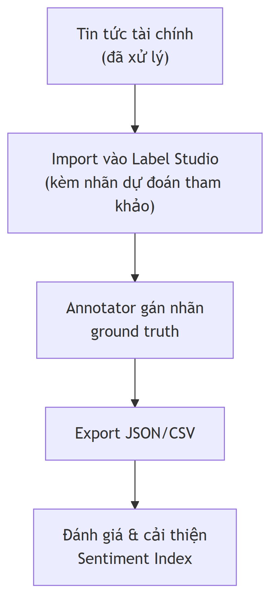
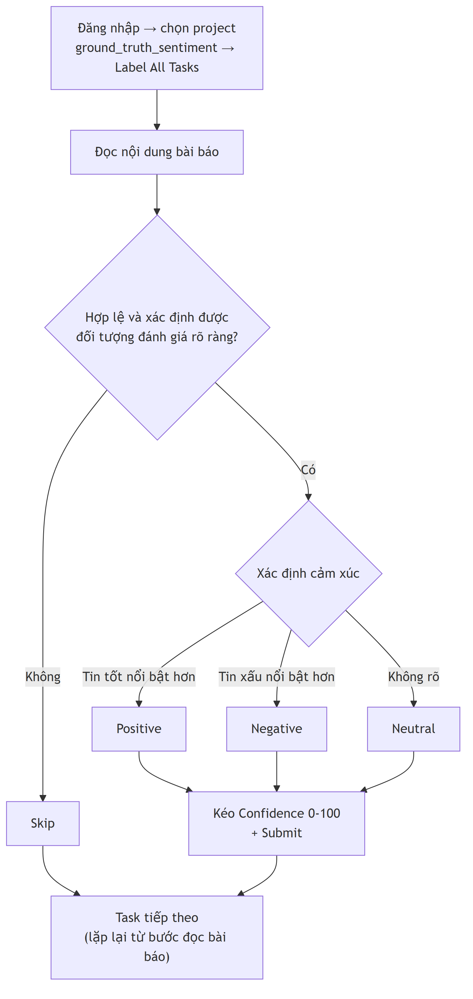



## 1. Mô tả tổng quan quy trình gán nhãn dữ liệu

Bài toán chỉ có 1 bước: gán nhãn cảm xúc (Positive/Negative/Neutral) trực
tiếp cho từng bài báo.

### 1.1 Luồng dữ liệu

{fig-align="center" width=55%}

### 1.2 Thông tin project

| Thành phần | Mô tả |
|---|---|
| Tên project | `ground_truth_sentiment` |
| Nhãn cần gán | `Positive` / `Negative` / `Neutral` + `Confidence (0–100)` |
| Chỉ tiêu số lượng | 1,000–5,000 bài gán nhãn ground truth |
| Output | Export JSON/CSV |

## 2. Mục tiêu

Mục tiêu của việc gán nhãn `ground_truth_sentiment`:

1. Tạo **tập nhãn chuẩn do con người xác nhận** để đo độ chính xác thực tế của model.
2. Xa hơn: cải thiện độ tin cậy của **Equity Sentiment Index**, phục vụ phân
   tích tương quan/hồi quy với chỉ số VN-Index.
3. Chỉ tiêu số lượng: **1,000–5,000 bài** được gán nhãn ground truth.

## 3. Nhãn (Labels)

Mỗi task hiển thị **nội dung bài báo** và Annotator cần chọn một trong ba nhãn:

| Nhãn | Mô tả |
|---|---|
| **Positive** | Tin tích cực cho doanh nghiệp/cổ phiếu (tăng trưởng, lãi tăng, cổ đông lớn mua vào, vượt kế hoạch, ký được hợp đồng lớn...) |
| **Negative** | Tin tiêu cực (thua lỗ, giảm doanh thu/lợi nhuận, bán tháo, không hoàn thành kế hoạch, bị phạt/kiện tụng...) |
| **Neutral** | Tin trung tính, chỉ mang tính thông báo/thống kê, không rõ tích cực hay tiêu cực (VD: công bố lịch họp ĐHĐCĐ, báo cáo định kỳ không có biến động đáng kể) |

Kèm theo mỗi nhãn là **Độ tin cậy (Confidence, 0–100)** — mức độ chắc chắn
của annotator với lựa chọn của mình (mặc định 80, kéo thanh trượt để điều
chỉnh).

## 4. Quy trình Annotation

### Cách vào:
1. Truy cập **QuestLab**
2. Đăng nhập bằng tài khoản được cấp.
3. Chọn project **ground_truth_sentiment**.
4. Bấm **Label All Tasks** để bắt đầu.

### Nhiệm vụ:
1. Đọc nội dung bài báo.
2. Chọn nhãn cảm xúc **thực sự đúng** theo bạn phù hợp với ngữ cảnh tài chính 
3. Kéo thanh trượt **Độ tin cậy (0–100)** để thể hiện mức độ chắc chắn.
4. Bấm **Submit** để xác nhận và chuyển sang bài tiếp theo.

### Nguyên tắc khi phân vân:
- Đánh giá theo **tác động thực tế đến doanh nghiệp/cổ phiếu được nhắc tới**,
  không đánh giá theo văn phong hay từ ngữ đơn thuần.
- Nếu bài có cả tin tốt lẫn tin xấu, có thể bấm **Skip**
- **Tin tổng hợp nhiều doanh nghiệp** (VD: điểm tin thị trường, so sánh nhiều
  mã cổ phiếu cùng lúc):
  - Nếu tất cả doanh nghiệp được nhắc đều **cùng một xu hướng** (cùng
    tăng/cùng giảm) → vẫn gán nhãn theo xu hướng chung đó.
  - Nếu kết quả **trái chiều** giữa các doanh nghiệp (một số tăng, một số
    giảm) và không có doanh nghiệp nào là trọng tâm rõ ràng → bấm **Skip**,
    vì một nhãn duy nhất không phản ánh đúng cho bất kỳ mã cổ phiếu cụ thể
    nào, gán bừa sẽ gây nhiễu cho tập ground truth.
  - Nếu bài có **1 doanh nghiệp chính làm chủ thể** (thường nêu ở tiêu đề),
    các doanh nghiệp khác chỉ được nhắc để so sánh/bối cảnh → gán theo
    sentiment của doanh nghiệp chính, bỏ qua phần phụ.
- Nếu bài không đọc được / nội dung lỗi / không liên quan tài chính-chứng
  khoán → bấm **Skip**.

### Sơ đồ quy trình:



{fig-align="center" width=65%}

*(Không hợp lệ = lỗi/không liên quan/tin trái chiều không rõ trọng tâm — xem
chi tiết ở phần "Nguyên tắc khi phân vân" phía trên. Quy trình lặp lại cho
đến khi hết task trong queue.)*

### Xử lý task bị Skip

Một task bị Skip **không bị loại bỏ ngay** — hệ thống xử lý theo 2 hướng tùy
số lần bị Skip:

- **Mới bị Skip bởi 1 annotator**: task tự động quay lại hàng đợi để
  **annotator thứ 2 kiểm tra lại** (không loại bỏ). Trong lúc chờ người thứ 2
  xử lý, task được **đánh dấu (flag)** để tiện theo dõi.
  - Nếu annotator thứ 2 gán nhãn thành công (không Skip) → task được tính
    bình thường, nhãn của annotator thứ 2 là kết quả cuối cùng.
- **Bị Skip bởi cả 2 annotator** (annotator thứ 2 kiểm tra lại nhưng cũng
  Skip): xác nhận đây là task không thể gán nhãn được (dữ liệu lỗi, nội dung
  mơ hồ, hoặc không đủ thông tin) → **loại bỏ hẳn khỏi tập ground truth khi
  xuất file**, không tính vào kết quả cuối cùng.

## 5. Mẫu gán nhãn (Labeling Config)

Giao diện gán nhãn sử dụng **Choices** để chọn nhãn cảm xúc và **Number** (slider) để
kéo thả độ tin cậy (0–100, mặc định 80). Cấu hình dưới đây mang tính **tham khảo** —
nếu khác với giao diện thực tế trên Label Studio, cấu hình trong **Project Settings ▸
Labeling Interface** là chuẩn.

```xml
<View>
    <Header value="Bài báo"/>

    <Text
        name="content"
        value="$content"/>

    <Header value="Chọn cảm xúc"/>

    <Choices
        name="sentiment"
        toName="content"
        choice="single"
        required="true">

        <Choice value="Positive"/>
        <Choice value="Negative"/>
        <Choice value="Neutral"/>

    </Choices>

    <Header value="Độ tin cậy (Confidence)"/>

    <Text
        name="confidence_desc"
        value="0 = Đoán mò | 50 = Khá chắc chắn | 100 = Hoàn toàn chắc chắn"/>

    <Number
        name="confidence"
        toName="content"
        min="0"
        max="100"
        step="5"
        defaultValue="80"
        slider="true"
        required="true"/>

</View>
```

## 6. Tiêu chí Quality Review

> Đây là quy trình **đề xuất** (hiện repo chưa có sẵn quy trình QA tự động),
> áp dụng khi số lượng annotator > 1 hoặc khi cần kiểm tra chất lượng trước
> khi dùng tập ground truth để train model.

- **Spot-check ngẫu nhiên**: định kỳ (VD: mỗi 500 task hoàn thành), admin
  lấy mẫu ngẫu nhiên ~10% annotation đã Submit để review lại tính hợp lý của
  nhãn.
- **Ưu tiên review các trường hợp**:
  - Độ tin cậy (confidence) thấp (< 50) — annotator tự đánh giá là không
    chắc chắn.
  - Task bị Skip nhiều lần liên tiếp bởi nhiều annotator khác nhau — có thể
    do dữ liệu lỗi/nhiễu, cần loại khỏi tập.
- **Theo dõi theo từng annotator**:
  - Tỷ lệ Skip quá cao (VD: > 30%) so với mặt bằng chung → xem lại có phải
    do task thực sự khó, hay annotator chưa hiểu rõ tiêu chí.
  - Tốc độ gán nhãn bất thường (quá nhanh so với độ dài bài báo) → khả năng
    gán ẩu, cần review lại mẫu ngẫu nhiên của người đó. Căn cứ định lượng là
    trường **`lead_time`** — số giây Label Studio **tự động ghi lại cho mỗi
    annotation**, tính từ lúc task hiện ra đến lúc annotator bấm Submit. Quy
    ước: annotation có `lead_time` dưới ~20 giây (với bài báo dài vài đoạn)
    bị coi là gán ẩu và đưa vào diện review; nếu nhãn sai thì loại bỏ và
    không tính công lượt đó. Lưu ý `lead_time` có thể bị thổi phồng nếu
    annotator mở task rồi để đó làm việc khác, nên chỉ dùng làm tín hiệu sàng
    lọc, không phải bằng chứng tuyệt đối.
- **Đo độ đồng thuận (Inter-Annotator Agreement)**: khi có ≥ 2 annotator,
  bật `overlap` cho một tập con nhỏ (VD: 5–10% task) để cùng gán nhãn độc
  lập, sau đó tính tỷ lệ đồng thuận (agreement rate) — làm căn cứ đánh giá
  độ tin cậy chung của tập ground truth.
- **Tiêu chí chấp nhận trước khi dùng để train model**: tỷ lệ Skip toàn bộ
  project không vượt quá ngưỡng đặt trước (VD: 20%), và đã spot-check xong
  toàn bộ các trường hợp bị flag ở trên.

## 7. Checklist quy trình

### 7.1 Trước khi bắt đầu

- Task đã được import đầy đủ vào project **ground_truth_sentiment**.
- Labeling Interface đã cấu hình đúng (nhãn Positive/Negative/Neutral + Confidence slider).
- Annotator đã được cấp tài khoản đăng nhập.
- Annotator đã đọc và hiểu rõ **Mục 3 (Nhãn)** và phần **"Nguyên tắc khi phân vân"** ở Mục 4.
- Đã thống nhất chỉ tiêu số lượng bài và deadline (nếu có) với annotator.

### 7.2 Trong quá trình annotation

- Theo dõi tiến độ qua QuestLab dashboard (số task đã Submit / còn lại / Skip).
- Định kỳ spot-check theo tiêu chí ở **Mục 6**.
- Giải đáp thắc mắc của annotator với các bài khó xác định (tin trái chiều, nhiều doanh nghiệp...).

### 7.3 Sau khi annotation

- Export dữ liệu đã gán nhãn (JSON/CSV) từ QuestLab.
- Loại bỏ các task bị Skip bởi cả 2 annotator, theo quy tắc ở phần **"Xử lý task bị Skip"**.
- Spot-check/QA toàn bộ trường hợp bị flag theo **Mục 6** trước khi coi là ground truth chính thức.
- Dùng tập ground truth để đo độ chính xác của model hiện tại và/hoặc cải thiện **Equity Sentiment Index**.



## 8. Chi phí và thời gian dự kiến (tham khảo)

Ước tính cho mục tiêu **5.000 bài**, mỗi bài được **2 annotator** gán độc lập.

### 8.1 Giả định

| Tham số | Giá trị |
|---|---|
| Số bài | 5.000 |
| Số annotator / bài | 2 |
| Tổng số lượt gán | 10.000 |
| Đơn giá | 300đ / lượt |
| Tốc độ giả định | 30 giây / lượt |
| Số annotator làm song song | 2 |

### 8.2 Chi phí

| Khoản | Cách tính | Tiền |
|---|---|---|
| Gán nhãn chính | 10.000 lượt × 300đ | 3.000.000đ |
| Dự phòng Skip + requeue (~10%) | ~1.000 lượt × 300đ | ~300.000đ |
| Re-label các ca bị QA loại (~5%) | ~500 lượt × 300đ | ~150.000đ |
| **Tổng nên chuẩn bị** | | **~3,3–3,5 triệu đồng** |

3 triệu là con số "sạch"; thực tế luôn phát sinh lượt lặp lại do Skip và QA.

### 8.3 Thời gian

Ở tốc độ 30 giây/lượt:

- Tổng công: 10.000 lượt × 30 giây = **5.000 phút ≈ 83 giờ**.
- Chia cho 2 annotator làm song song: **~42 giờ / người**.

| Số giờ làm / ngày / người | Số ngày hoàn thành (chưa tính hao phí) |
|---|---|
| 4 giờ | ~11 ngày |
| 5 giờ | ~8–9 ngày |
| 6 giờ | ~7 ngày |
| 8 giờ (toàn thời gian) | ~5 ngày |

Cộng thêm ~15–20% cho Skip, nghỉ giải lao và hỏi đáp các ca khó:

- Bán thời gian (~5 giờ/ngày/người): **khoảng 2 tuần**.
- Toàn thời gian (~8 giờ/ngày/người): **khoảng 1–1,5 tuần**.

### 8.4 Thu nhập theo giờ của annotator

Ở tốc độ 30 giây/lượt → 120 lượt/giờ → **36.000đ/giờ/người** (đơn giá là 300đ
mỗi *lượt*, không phải mỗi giờ).

Nếu tốc độ thực tế chậm hơn thì thu nhập giờ giảm theo: 1 phút/lượt →
18.000đ/giờ; 2 phút/lượt → 9.000đ/giờ.

> **Lưu ý:** 30 giây/lượt là rất nhanh cho một bài báo dài vài đoạn — mức này
> chỉ đủ để đọc lướt. Nếu muốn annotator đọc kỹ, tốc độ thực tế sẽ gần
> 1 phút/lượt hơn. Ngoài ra tốc độ kế hoạch 30 giây khá sát ngưỡng cảnh báo
> `lead_time` ~20 giây ở Mục 6, nên cần theo dõi chặt phân bố `lead_time` để
> phân biệt "làm nhanh nhưng vẫn đọc" với "gán ẩu".